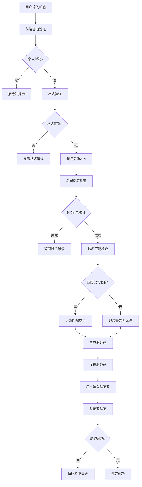

# 邮箱验证安全机制

## 概述

为了确保只有真正有管理权限的用户才能绑定公司，同时保持良好的用户体验，我们实现了平衡的邮箱验证机制。

## 安全验证层级

### 1. 前端基础验证
- **个人邮箱过滤**：拒绝常见个人邮箱域名（Gmail、Yahoo、Hotmail等）
- **格式验证**：确保邮箱格式正确
- **域名匹配检查**：建议使用与公司名称匹配的邮箱（非强制）

### 2. 后端深度验证
- **MX记录验证**：通过DNS查询验证域名是否真实存在邮件服务器
- **域名格式验证**：确保域名格式正确
- **公司名称匹配**：建议使用与公司名称匹配的邮箱（非强制）

### 3. 验证码机制
- **6位数字验证码**：随机生成，10分钟有效期
- **一次性使用**：验证成功后立即失效
- **防重放攻击**：每个邮箱只能有一个有效验证码

## 验证流程



## 安全特性

### 防止的威胁
1. **个人邮箱滥用**：拒绝个人邮箱地址
2. **虚假域名**：通过MX记录验证域名真实性
3. **验证码重放**：一次性验证码，防止重复使用
4. **暴力破解**：验证码有效期限制

### 用户友好的验证规则

#### 公司名称：QIXIN CO PTY LTD
**✅ 接受的邮箱域名：**
- `@qixin.com.au` (完全匹配)
- `@qixinco.com.au` (部分匹配)
- `@qixinpty.com.au` (部分匹配)
- `@qixincoptyltd.com.au` (完全匹配)
- `@mycompany.com.au` (其他公司邮箱，允许但记录警告)

**❌ 拒绝的邮箱域名：**
- `@gmail.com` (个人邮箱)
- `@yahoo.com` (个人邮箱)
- `@fakecompany.com` (无MX记录)
- `@invalid` (格式错误)

## 技术实现

### 前端验证 (`validateCompanyEmail`)
```typescript
function validateCompanyEmail(email: string, companyName: string) {
  // 1. 检查个人邮箱域名（强制拒绝）
  // 2. 验证域名格式（强制验证）
  // 3. 检查域名与公司名称匹配（建议性，不强制）
}
```

### 后端验证 (`validateEmailDomain`)
```typescript
async function validateEmailDomain(email: string) {
  // 1. DNS MX记录验证（强制验证）
  // 2. 域名格式验证（强制验证）
  // 3. 公司名称匹配验证（建议性，记录警告但不拒绝）
}
```

## 配置选项

### 个人邮箱域名列表
```typescript
const PERSONAL_EMAIL_DOMAINS = [
  'gmail.com', 'yahoo.com', 'hotmail.com', 'outlook.com', 'icloud.com',
  'qq.com', '163.com', '126.com', 'sina.com', 'sohu.com',
  'live.com', 'msn.com', 'aol.com', 'protonmail.com', 'tutanota.com'
];
```

### 验证码设置
- **长度**：6位数字
- **有效期**：10分钟
- **存储**：内存Map（生产环境应使用Redis）

## 用户体验优化

### 1. 宽松的域名匹配
- 只要邮箱域名包含公司名称的关键词即可
- 不强制要求完全匹配
- 允许使用其他公司邮箱（记录警告但不拒绝）

### 2. 友好的错误提示
- 清晰的错误信息
- 提供示例和建议
- 不阻止用户使用合理的邮箱地址

### 3. 渐进式验证
- 先进行基础验证
- 再进行深度验证
- 最后进行验证码验证

## 未来改进

1. **邮件发送集成**：集成真实的邮件发送服务
2. **Redis存储**：使用Redis存储验证码，支持分布式部署
3. **速率限制**：添加API调用频率限制
4. **日志记录**：记录验证失败尝试，用于安全监控
5. **白名单机制**：为特定公司配置邮箱域名白名单
6. **用户反馈**：收集用户反馈，进一步优化验证规则

## 测试用例

### 有效测试
- `john@qixin.com.au` ✅ (完全匹配)
- `admin@qixinco.com.au` ✅ (部分匹配)
- `contact@mycompany.com.au` ✅ (其他公司邮箱，允许)
- `info@business.com.au` ✅ (其他公司邮箱，允许)

### 无效测试
- `user@gmail.com` ❌ (个人邮箱)
- `admin@yahoo.com` ❌ (个人邮箱)
- `test@fakecompany.com` ❌ (无MX记录)
- `invalid@email` ❌ (格式错误)

## 平衡安全与用户体验

我们的验证机制在安全性和用户体验之间找到了平衡：

- **安全性**：防止个人邮箱滥用和虚假域名
- **灵活性**：允许使用合理的公司邮箱，即使不完全匹配
- **友好性**：提供清晰的提示和建议，不阻止合法用户 